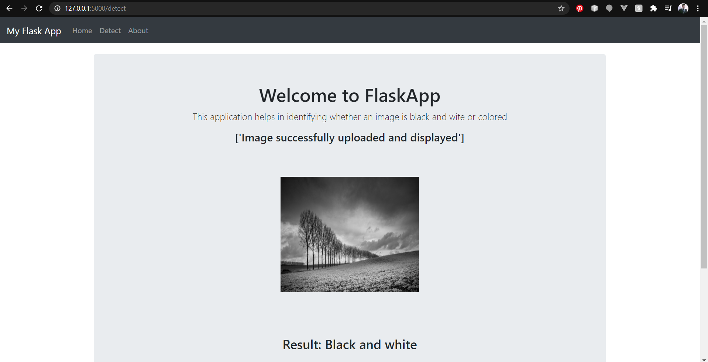
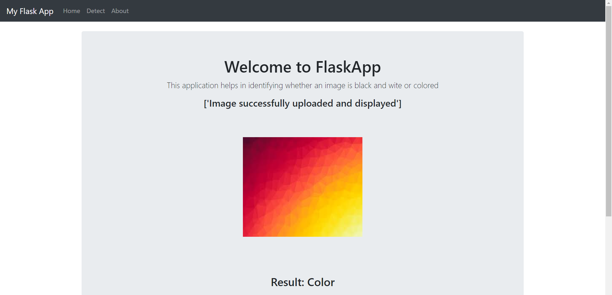
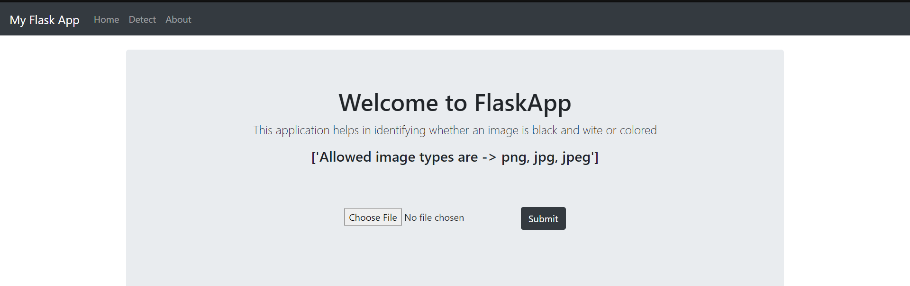
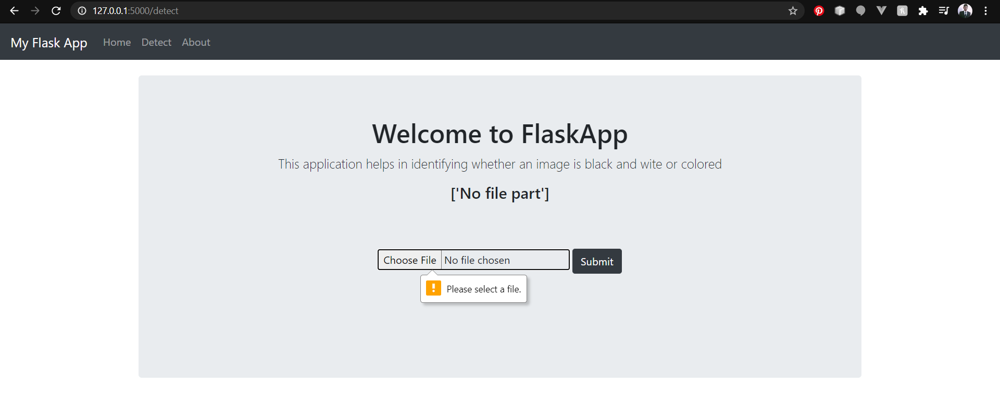
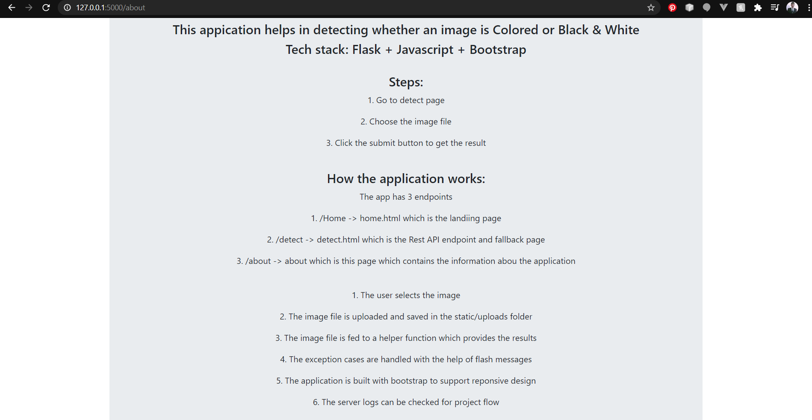
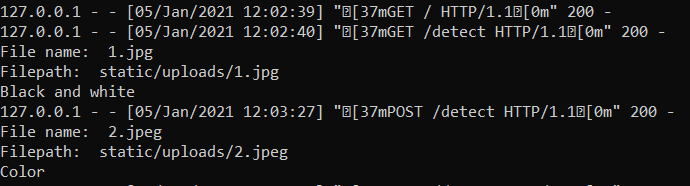

# FlaskRestAPI_Assignment
Flask Rest API
This appication helps in detecting whether an image is Colored or Black & White
Tech stack: Flask + Javascript + Bootstrap

Implement:
1. Clone repo
2. From repo -> python app.py
3. Go to link provided by Flask server

Steps:
1. Go to detect page
2. Choose the image file from TestImages folder
3. Click the submit button to get the result

Home page:

Black and white image file:

Color file:

Different file type:

Without file:

About page:

Server logs:

