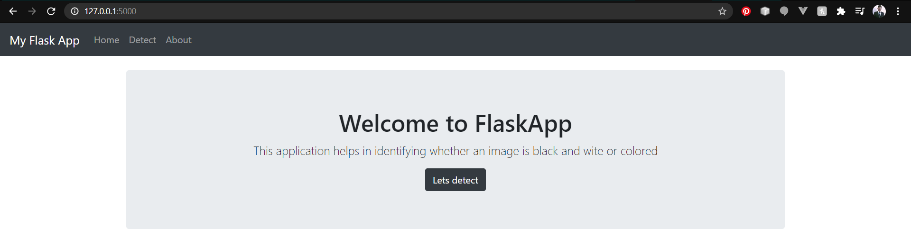

# FlaskRestAPI_Assignment
Flask Rest API
This appication helps in detecting whether an image is Colored or Black & White
Tech stack: Flask + Javascript + Bootstrap
Steps:
1. Go to detect page
2. Choose the image file
3. Click the submit button to get the result

Home page:

Black and white image file:

Color file:

Different file type:

Without file:

About page:

Server logs:
